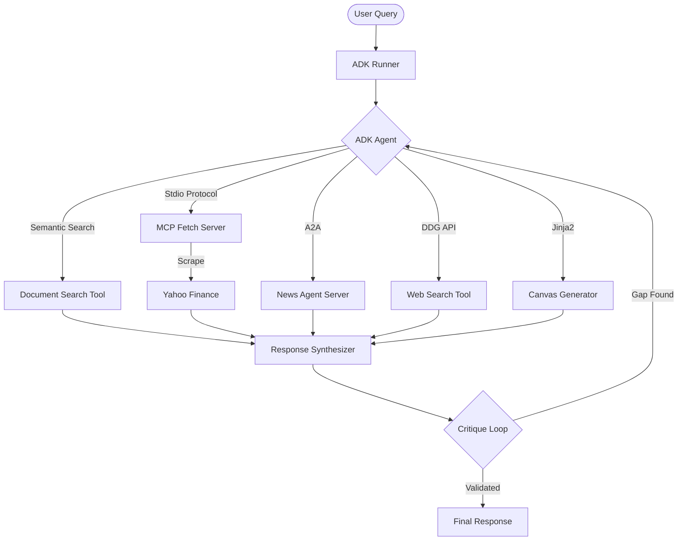

# 🤖 Autonomous ADK-Powered Research Agent

An advanced agentic RAG system built with **Google Gemini 2.0 Flash** and the **Google Agent Development Kit (ADK)**. Designed for autonomous planning, multi-source research, and iterative self-critique.


## 🎯 Grid University Module 3 Compliance

This project fulfills all requirements for the **Agentic Systems Capstone**:
- ✅ **Phase 1 & 2**: Built on the official **Google ADK** framework with autonomous tool planning.
- ✅ **Phase 3**: Integrated **Model Context Protocol (MCP)** server for context-verified financial retrieval.
- ✅ **Phase 4**: Implemented an **Autonomous Refinement Loop** (Critique & Refine).
- ✅ **Phase 5**: **Agent-to-Agent (A2A)** delegation to a specialized News Agent.
- ✅ **Phase 6**: **Canvas Tool** for generating rich Markdown/HTML reports and Code snippets.

## 🌟 Key Features

- **🧠 ADK Autonomous Agent**: Uses the official `google-adk` library for robust Plan → Execute → Synthesize cycles.
- **🔌 MCP Integration**: Routes financial queries (Stocks, Crypto, Currencies) through a dedicated Model Context Protocol server.
- **🔎 Hybrid RAG Pipeline**: Combines local document search (FAISS) with real-time web retrieval.
- **🔄 Iterative Critique Loop**: Self-evaluates responses and automatically performs follow-up research if gaps are detected.
- **🎨 Premium UI**: Streamlit interface showing the agent's **internal thought process** in real-time.

## 🏗️ Architecture



## 🚀 Getting Started

### Prerequisites
- Python 3.10+
- Google Cloud Project with Vertex AI enabled
- `GOOGLE_APPLICATION_CREDENTIALS` or active `gcloud auth`

### Installation

1. **Clone the repository**:
   ```bash
   git clone https://github.com/rtrgrid/Agentic-AI.git
   cd core-rag-agent
   ```

2. **Set up virtual environment**:
   ```bash
   python3 -m venv venv
   source venv/bin/activate
   ```

3. **Install dependencies**:
   ```bash
   pip install -r requirements.txt
   pip install google-adk torchvision
   ```

4. **Environment Variables**:
   Create a `.env` file:
   ```env
   PROJECT_ID="your-gcp-project"
   LOCATION="us-central1"
   HF_TOKEN="your-huggingface-token"
   ```

## 💻 Usage

### Launch Streamlit UI (Recommended)
```bash
# Starts both the UI and the News Agent
./venv/bin/python3 -m streamlit run streamlit_app.py
```
Access at `http://localhost:8501`.

### Run CLI Version
```bash
python3 -m app.main
```

## 📁 Project Structure

- `app/agent.py`: ADK Agent & Runner orchestration.
- `mcp-server/main.py`: FastMCP server for financial data retrieval.
- `app/critique.py`: Phase 4 self-evaluation logic.
- `app/tools/`: Official ADK `FunctionTool` implementations.
- `news_agent/`: Standalone sub-agent server (Phase 5).

---
*Built for the Grid University Gen AI Training Program.*
