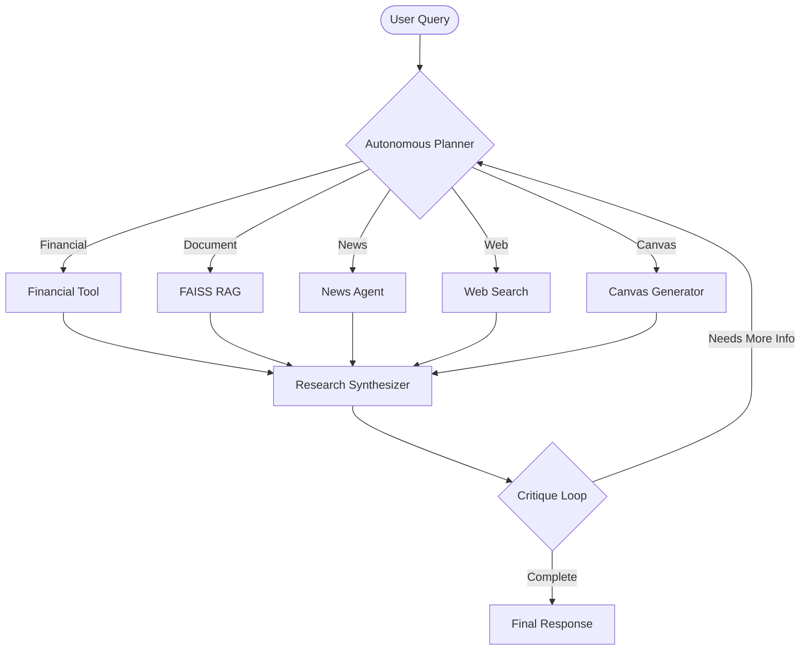

# 🤖 Autonomous Multi-Agent Research Agent

An advanced agentic RAG system built with **Gemini 2.0 Flash**, designed for autonomous planning, multi-source research, and iterative self-critique.


## 🌟 Key Features

- **🧠 Autonomous Planner**: Intelligently routes queries to specific tools (Financial, Document, Web, News).
- **🔎 Hybrid RAG Pipeline**: Combines local document search (FAISS) with real-time web retrieval.
- **🔄 Iterative Critique Loop**: Self-evaluates responses and performs follow-up research if information is missing.
- **🛠️ Multi-Tool Integration**:
  - **Document Search**: Semantic search over local PDFs.
  - **Financial Tool**: Real-time market data for stocks and crypto.
  - **Web Search**: Integration with Google Search/Tavily for live info.
  - **News Agent**: Specialized agent-to-agent (A2A) delegation for latest headlines.
  - **Canvas Tool**: Generates structured reports in Markdown, HTML, or Code.
- **🎨 Premium UI**: Sleek, dark-mode Streamlit interface with real-time streaming simulation.

## 🏗️ Architecture



## 🚀 Getting Started

### Prerequisites
- Python 3.9+
- Google Cloud Project with Vertex AI enabled
- (Optional) Docker

### Installation

1. **Clone the repository**:
   ```bash
   git clone https://github.com/rtrgrid/Agentic-AI.git
   cd core-rag-agent
   ```

2. **Set up virtual environment**:
   ```bash
   python -m venv venv
   source venv/bin/activate  # On Windows: venv\Scripts\activate
   ```

3. **Install dependencies**:
   ```bash
   pip install -r requirements.txt
   ```

4. **Environment Variables**:
   Create a `.env` file in the root directory:
   ```env
   GOOGLE_APPLICATION_CREDENTIALS="path/to/your/service-account.json"
   ```

## 💻 Usage

### Launch Streamlit UI (Recommended)
```bash
streamlit run streamlit_app.py
```
Access the interface at `http://localhost:8501`.

### Run CLI Version
```bash
python -m app.main
```

## 📁 Project Structure

- `app/`
  - `agent.py`: Main orchestration (Planner & Researcher).
  - `critique.py`: Self-correction and validation logic.
  - `rag/`: Embedding and FAISS vector store management.
  - `tools/`: Individual tool implementations (Web, Finance, News, etc.).
  - `data/`: PDF storage for local research.
- `streamlit_app.py`: Modern web interface.
- `news_agent/`: Standalone news-fetching sub-agent.
- `Dockerfile`: Containerization configuration.

## 🛠️ Tech Stack

- **LLM**: Gemini 2.0 Flash (via Vertex AI)
- **UI**: Streamlit
- **Vector DB**: FAISS
- **Embeddings**: Vertex AI Text Embeddings
- **Data Handling**: PyPDF2, BeautifulSoup4
- **Containerization**: Docker

---
*Built for the next generation of autonomous research.*
